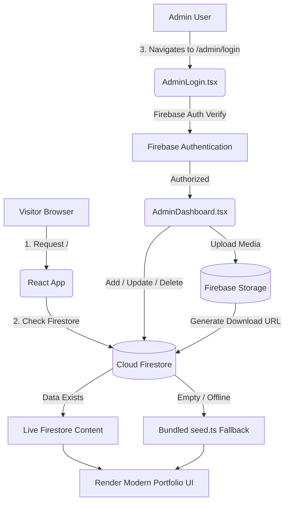

# 🏛️ Portfolio Project Architecture & Structure Guide

This document provides a comprehensive breakdown of the portfolio architecture, folder structure, data flow, CMS functionality, media storage, and security rules. It is designed to help any developer, collaborator, or reviewer understand the entire system end-to-end.

---

## 📑 Table of Contents
1. [Tech Stack & Key Libraries](#1-tech-stack--key-libraries)
2. [Complete Directory Structure](#2-complete-directory-structure)
3. [Architecture & Data Flow](#3-architecture--data-flow)
4. [Firestore Collections & Schema](#4-firestore-collections--schema)
5. [Admin CMS & Management (`/admin`)](#5-admin-cms--management-admin)
6. [Image & File Management (Firebase Storage)](#6-image--file-management-firebase-storage)
7. [Security & Access Rules](#7-security--access-rules)
8. [Setup, Environment Variables & Commands](#8-setup-environment-variables--commands)

---

## 1. Tech Stack & Key Libraries

- **Frontend Core**: [React 18](https://react.dev/) + [TypeScript](https://www.typescriptlang.org/) + [Vite](https://vitejs.dev/)
- **Styling**: [Tailwind CSS](https://tailwindcss.com/) + Custom Glassmorphism / HSL design tokens
- **Animations & Interactivity**: [Framer Motion](https://www.framer.com/motion/) + [Lucide React](https://lucide.dev/) icons
- **Backend & Cloud (BaaS)**: [Google Firebase](https://firebase.google.com/)
  - **Firebase Authentication**: Secure admin login (email/password).
  - **Cloud Firestore**: Real-time NoSQL database storing portfolio content.
  - **Firebase Storage**: Cloud storage for certificate images and résumé PDFs.
- **Deployment**: Vercel / Firebase Hosting ready.

---

## 2. Complete Directory Structure

```
Manjith-portfolio/
├── .env                         # Active Firebase environment variables (local)
├── .env.example                 # Example environment template for contributors
├── .firebaserc                  # Firebase project alias mapping
├── firebase.json                # Firebase configuration (hosting, firestore, storage)
├── firestore.rules              # Firestore security rules (public read, auth write)
├── storage.rules                # Firebase Storage security rules (public read, auth write)
├── index.html                   # HTML entry point (SEO tags, Google Fonts: Sora, Inter, JetBrains Mono)
├── package.json                 # Project dependencies & scripts
├── tailwind.config.js           # Design tokens, color palette, custom gradients
├── tsconfig.json                # TypeScript compiler configuration
├── vite.config.ts               # Vite build configuration
│
├── public/                      # Static assets served directly (favicons, etc.)
│
└── src/
    ├── App.tsx                  # Root application component (Navbar, Sections, Footer, Quick Admin Pill)
    ├── main.tsx                 # DOM mounting & Context provider wrapping
    ├── index.css                # Global CSS, Tailwind directives, glass utilities, custom scrollbars
    │
    ├── components/              # 🎨 Public Portfolio Sections
    │   ├── Navbar.tsx           # Floating responsive navbar with theme toggle & Admin Login CTA
    │   ├── Hero.tsx             # Animated hero: typing effect, dynamic CTA buttons, floating badges
    │   ├── Stats.tsx            # Animated metric counters (Years experience, projects, etc.)
    │   ├── About.tsx            # Personal summary, career objective & strengths
    │   ├── Skills.tsx           # Categorized skill badges with proficiency meters
    │   ├── Projects.tsx         # Project cards with tags, GitHub links, and live demo badges
    │   ├── Architecture.tsx     # Animated SVG microservices request-flow topology diagram
    │   ├── Experience.tsx       # Timeline of professional work experience & responsibilities
    │   ├── Education.tsx        # Academic history, degrees, coursework & CGPA
    │   ├── Certifications.tsx   # Verified credentials with direct badges & images
    │   ├── Contact.tsx          # Interactive contact form (mailto) & direct social channels
    │   ├── Footer.tsx           # Footer copyright & quick navigation links
    │   │
    │   └── admin/               # ⚙️ CMS Admin Panel Components
    │       ├── ProtectedRoute.tsx    # Higher-order route guard requiring Firebase Auth
    │       ├── CollectionEditor.tsx  # Generic CRUD UI for list collections (Add, Edit, Delete, Order)
    │       ├── DocumentEditor.tsx    # Generic editor for singleton documents (Profile, Site Settings)
    │       └── FileUpload.tsx        # File uploader to Firebase Storage with live preview & delete
    │
    ├── pages/                   # 📄 Routed Application Pages
    │   ├── AdminLogin.tsx       # Secure email/password login screen
    │   └── AdminDashboard.tsx   # Multi-tab admin control center (Profile, Projects, Skills, etc.)
    │
    ├── context/                 # 🌐 Application Context Providers
    │   ├── AuthContext.tsx      # Firebase auth listener & currentUser state
    │   └── ThemeContext.tsx     # Dark / Light mode state with localStorage persistence
    │
    ├── hooks/                   # 🪝 Custom React Hooks
    │   ├── useFirestoreCollection.ts # Real-time Firestore subscription with seed.ts fallback
    │   ├── useFirestoreDocument.ts   # Document-level subscription for singleton records
    │   ├── useProfile.ts             # Dedicated hook for personal profile details
    │   ├── useSocialLinks.ts         # Dedicated hook for social URLs & icons
    │   └── useInView.ts              # IntersectionObserver hook for viewport animations
    │
    ├── data/                    # 📦 Fallback & Static Architecture Data
    │   ├── seed.ts              # Default bundled portfolio content (used before Firestore is populated)
    │   └── profile.ts           # Architecture SVG topology layout coordinates & descriptions
    │
    ├── lib/                     # 🔌 Firebase SDK Initialization & Helpers
    │   ├── firebase.ts          # Firebase App, Auth, Firestore, and Storage initialization
    │   ├── firestoreApi.ts      # Typed CRUD operations (addItem, updateItem, deleteItem, setSingletonDoc)
    │   └── seedDatabase.ts      # One-click button in Admin to populate Firestore with seed data
    │
    └── types/                   # 📐 TypeScript Interface Definitions
        ├── firestore.ts         # Schema for all Firestore documents (FsProject, FsProfile, etc.)
        ├── api.ts               # API response and operation status types
        └── index.ts             # Shared application contracts and navigation types
```

---

## 3. Architecture & Data Flow

The portfolio employs a **Hybrid Client-Driven Architecture**:



### Highlights:
1. **Zero Downtime / Offline Fallback**:
   - The public site never displays a blank page or broken loader.
   - If Firestore is empty, initializing, or offline, the custom hooks automatically fallback to `src/data/seed.ts`.
2. **Direct Firebase SDK Integration**:
   - No custom backend server is needed. The frontend communicates directly with Firestore and Firebase Storage using official SDKs, secured with server-side rules.
3. **Optimistic Updates**:
   - Admin updates are processed cleanly with loading feedback and immediate real-time propagation across active sessions.

---

## 4. Firestore Collections & Schema

All document contracts are strongly typed in [`src/types/firestore.ts`](file:///c:/Users/manji/IdeaProjects/Manjith-portfolio/src/types/firestore.ts):

| Collection / Doc | Type Name | Description | Key Fields |
| :--- | :--- | :--- | :--- |
| `profiles/me` | `FsProfile` | Personal details (Singleton) | `name`, `role`, `taglines[]`, `summary`, `objective`, `resumeUrl`, `email`, `whatsapp`, `github`, `linkedin`, `leetcode`, `strengths[]` |
| `settings/site` | `FsSettings` | Global website settings (Singleton) | `title`, `tagline`, `availabilityStatus`, `yearsExperience`, `location` |
| `skills` | `FsSkill` | Tech skills by category | `name`, `category`, `proficiency` (0-100), `displayOrder` |
| `projects` | `FsProject` | Portfolio case studies | `title`, `description`, `technologies[]`, `githubUrl`, `demoUrl`, `featured`, `displayOrder` |
| `experiences` | `FsExperience` | Professional roles | `companyName`, `role`, `startDate`, `endDate`, `isCurrent`, `responsibilities[]`, `skillNames[]` |
| `educations` | `FsEducation` | Degrees & academic background | `degree`, `institution`, `cgpa`, `startDate`, `endDate` |
| `certifications` | `FsCertification` | Credentials & Badges | `title`, `issuer`, `issueDate`, `credentialUrl`, `imageUrl` |
| `socialLinks` | `FsSocialLink` | Social platform profiles | `platform`, `url`, `icon`, `displayOrder` |
| `stats` | `FsStat` | Highlight statistics | `label`, `value`, `suffix`, `displayOrder` |

---

## 5. Admin CMS & Management (`/admin`)

### Accessing the Admin Panel
- **URL**: Navigate to `/admin/login` or click the **Admin Login** button in the top navbar.
- **Login Credentials**: Authenticates with Firebase Authentication (Email & Password).

### CMS Features
1. **Singleton Document Editing** (`DocumentEditor.tsx`):
   - Used for `profiles/me` and `settings/site`.
   - Edits single-record fields like bio, contact links, resume URL, and typing taglines.
2. **Collection Management** (`CollectionEditor.tsx`):
   - Used for multi-item collections (`projects`, `skills`, `experiences`, `certifications`, `stats`).
   - Supports:
     - **Add**: Creates a new record in Firestore with auto-generated ID.
     - **Edit**: Updates fields in-place.
     - **Delete**: Prompts confirmation and removes the document permanently from Firestore.
     - **Display Order**: Controls sorting order on the public site.
3. **Database Seeding (`seedDatabase.ts`)**:
   - A button in the Admin header allows writing all local data from `seed.ts` into Firestore with a single click.

---

## 6. Image & File Management (Firebase Storage)

Images and files are managed through [`src/components/admin/FileUpload.tsx`](file:///c:/Users/manji/IdeaProjects/Manjith-portfolio/src/components/admin/FileUpload.tsx).

### Where Files Are Stored
- **Bucket**: `manjith-portfolio.firebasestorage.app`
- **Folders**:
  - `certificates/`: Images and badge icons for certifications.
  - `resumes/`: Hosted résumé documents (PDF / DOCX).

### Workflow:
1. **Upload**: User selects a file via the admin panel.
2. **Firebase Storage Upload**: Uploads to the bucket using `uploadBytes` and retrieves an HTTPS download URL via `getDownloadURL`.
3. **Firestore Linkage**: The download URL is stored in the respective document (`imageUrl` or `resumeUrl`).
4. **Live Preview**: Image thumbnails or PDF download links render in real-time in the admin UI.
5. **Deletion / Clearing**: Clicking the red **`✕`** button clears the URL from the document.

---

## 7. Security & Access Rules

Security is enforced at the database and storage level via Firebase Rules.

### A. Firestore Rules (`firestore.rules`)
```javascript
rules_version = '2';
service cloud.firestore {
  match /databases/{database}/documents {
    // Anyone can read portfolio content
    match /{document=**} {
      allow read: if true;
      allow write: if request.auth != null; // Only authenticated admin can modify
    }
  }
}
```

### B. Storage Rules (`storage.rules`)
```javascript
rules_version = '2';
service firebase.storage {
  match /b/{bucket}/o {
    // Anyone can view certificate images and download resumes
    match /{allPaths=**} {
      allow read: if true;
      allow write: if request.auth != null; // Only authenticated admin can upload/delete
    }
  }
}
```

---

## 8. Setup, Environment Variables & Commands

### Environment Configuration (`.env`)
Create a `.env` file in the project root with your Firebase credentials:

```env
VITE_FIREBASE_API_KEY=your_api_key
VITE_FIREBASE_AUTH_DOMAIN=your_project.firebaseapp.com
VITE_FIREBASE_PROJECT_ID=your_project_id
VITE_FIREBASE_STORAGE_BUCKET=your_project.firebasestorage.app
VITE_FIREBASE_MESSAGING_SENDER_ID=your_messaging_sender_id
VITE_FIREBASE_APP_ID=your_app_id
VITE_FIREBASE_MEASUREMENT_ID=your_measurement_id
```

### Available Scripts

| Command | Action |
| :--- | :--- |
| `npm run dev` | Starts Vite local development server on `http://localhost:5173/` |
| `npm run build` | Compiles TypeScript (`tsc -b`) and generates production bundle in `dist/` |
| `npm run preview` | Locally serves the optimized production build |
| `npx firebase deploy` | Deploys hosting, firestore rules, and storage rules to Firebase |

---

## 💡 Summary for Developers & Reviewers

1. **All public UI updates dynamically from Firestore**, but remains 100% resilient if offline thanks to `src/data/seed.ts`.
2. **Admins have full CRUD control** over projects, experience, skills, certificates, and profile info without touching any code.
3. **Images & Résumé files upload directly to Firebase Storage** with instant previews and link updates.
4. **Live projects like the E-commerce app** (`https://e-commerce-frontend-chi-seven.vercel.app/`) are highlighted with custom badges and direct action buttons.
